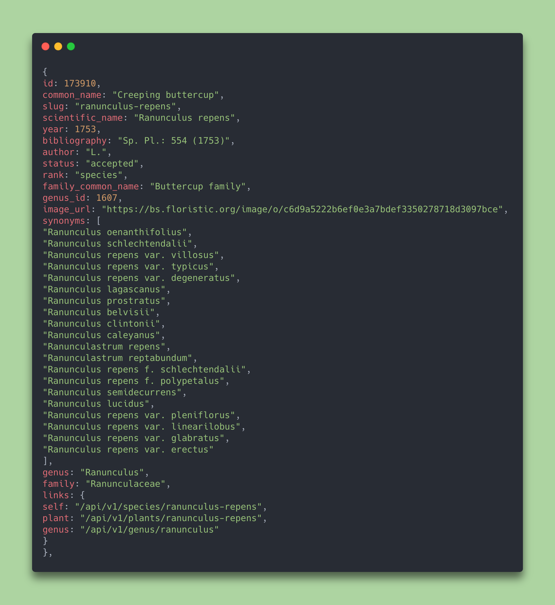
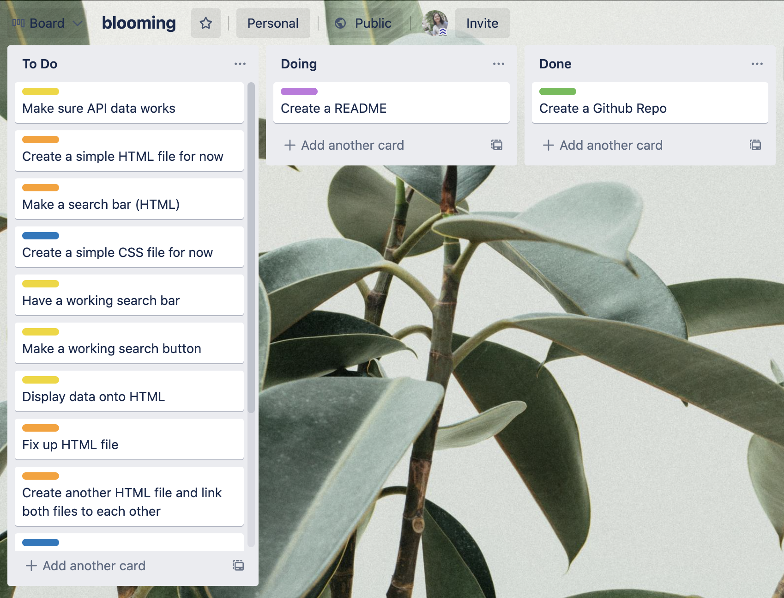

# ***blooming***
#### by Jady Hom

***blooming*** is a website for beginners to search through our plant index. Users will be able to search and find out the plant's common names, scientific names, genuses, families, and family common names.

**Plant Index:**
 * Common Name
 * Scientific Name
 * Genus
 * Family Name
 * Common Family Name

:seedling:

### Users
* Users are first welcomed by the home page.
* Users will see title of website; clickable and will bring them to search page.
* Users will see a search bar where they can input text on the search page.
* Users will be able to look up plants by typing into the search bar.
* Users will see image icons and the plant index from their search.
* Users will also see two navigation links on the top that will link to other pages.
* Users clicking on 'blooming' will link them to home page.
* Users clicking on 'search' will link them to the search page.
* Users clicking on 'about' will link them to an about page with website description, contact form, and social medias.

:seedling:

### Getting Started

**My Trello Board:** https://trello.com/b/Q979KG4j/blooming

:seedling:

### Credits

Trello Board: https://trello.com

API: https://trefle.io/

Code Screenshot: https://carbon.now.sh/

Icons8: https://icons8.com/icons

Pexels: https://www.pexels.com/

CodePen CSS Inspiration: https://codepen.io/AlexKP/pen/xJjYwZ

:seedling::seedling::seedling: