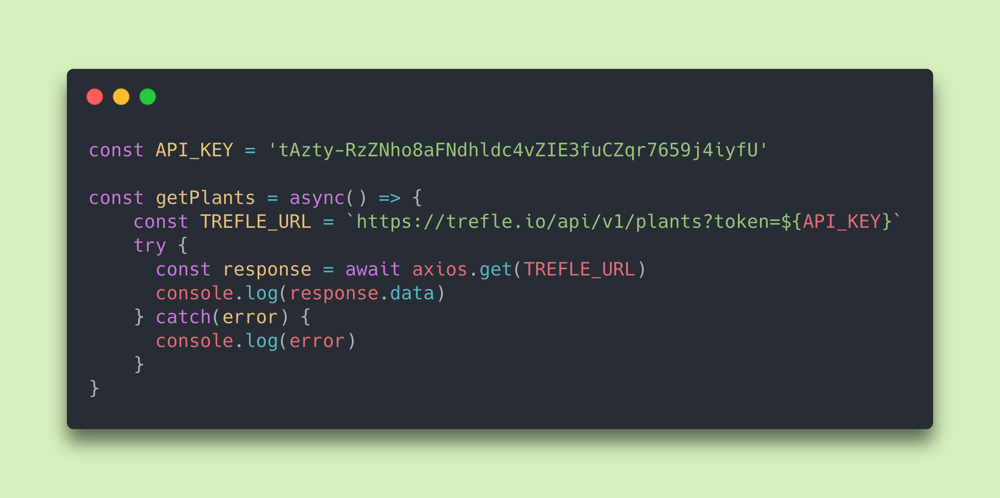

# **blooming**
#### by Jady Hom

**blooming** is for new plant lovers, new gardeners, and anyone who wants to start learning more about plants! 

:seedling:

Users will be able to look up the basic but necessary information about plants:

Types of Plant Info

 * **Common Name**
 * **Scientific Name**
 * **Plant Duration**
 * **Growth Habit**
 * **Growth Description**
 * **Growth Months**
 * **Average Height (cm)**
 * **Toxicity**
 * **Required Lighting**
 * **Minimum and Maximum Temperature**
 * **Minimum and Maximum Precipitation**
 * **Soil**

:seedling:

### Getting Started

**Trello Board:** https://trello.com/b/Q979KG4j/blooming

:seedling:

### Users
* Users are first welcomed by the home page
*

:seedling:

### Credits
[Trello Board](https://trello.com)

**API:** https://trefle.io/

**Code Screenshot:** https://carbon.now.sh/