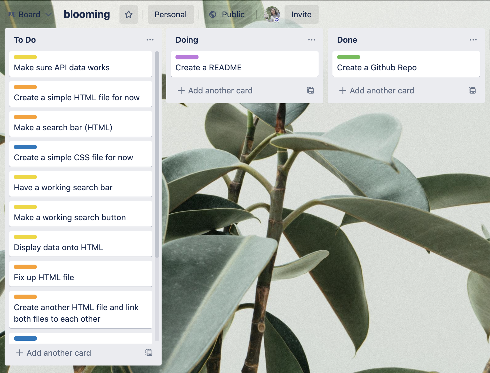

# ***blooming***
#### by Jady Hom

***blooming*** is for new plant lovers, new gardeners, and anyone who wants to start learning more about plants! 
Users will be able to look up plant types and acquire the basic, but necessary information and how to care for them.

**Types of Plant Info:**
 * Common Name
 * Scientific Name
 * Plant Duration (Annual, Biennial, or Perennial)
 * Growth Habit (General Appearance)
 * Growth Description
 * Growth Months
 * Average, Minimum, and Maximum Height(cm)
 * Toxicity
 * Required Lighting
 * Minimum and Maximum Temperature
 * Minimum and Maximum Precipitation
 * Humidity
 * Soil Texture

:seedling:

### Users
* Users are first welcomed by the home page
* Users will see title and one-line description of website
* Users will see a search bar where they can input text
* Users will be able to look up plants by typing into the search bar
* Users will see small image icons and the plant common name and/or scientific name according to what they searched up
* Users will also see two nav links that will link them to other pages.
* One will link them to a page with all the plants listed out - PLANT TYPES
* One will link them to an About page with website description, contact information, and social media

:seedling:

### Getting Started

**My Trello Board:** https://trello.com/b/Q979KG4j/blooming

:seedling:

### Credits
[Trello Board](https://trello.com)

API: https://trefle.io/

Code Screenshot: https://carbon.now.sh/

:seedling::seedling::seedling: